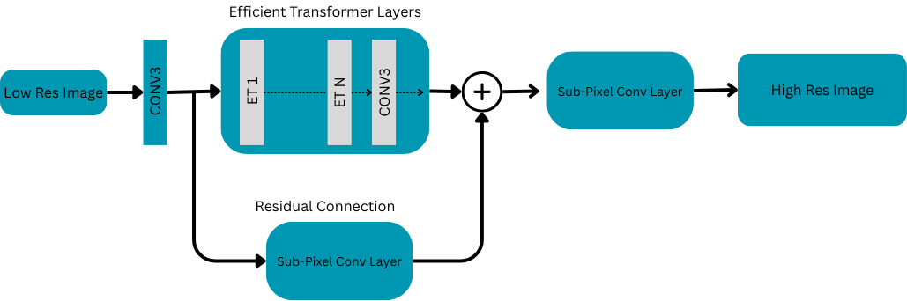

## Single Image Super Resolution using an Efficient Transformer-based Sub-Pixel Convolution Neural Network

Image restoration is a very popular and old problem in the domain of computer vision. The goal is to restore a higher resolution of an image from a lower resolution and noisier image. 
This method is also referred to as single-image super-resolution. It has useful impacts in multiple domains like the medical sector, surveillance, and satellite image enhancements. 
While there are super-resolution methods using a convolutional neural network, with the introduction of transformers, there are multiple super-resolution models that use the transformer architecture. 
But one pivotal problem with the transformer models is that they are computationally expensive, creating the opportunity for providing an optimized transformer-based solution for this problem. 
In this project, we propose an efficient transformer-based hybrid architecture, ETSPCN, to generate higher-resolution images from lower-resolution images. 
Although the initial results are not great, there are noticeable improvements in the computational performance. 
This can pave the way for future research in building efficient transformers for image super-resolution.

## Model Architecture

This model is a hybrid of the popular SwinIR and Efficient Transformer from this paper: [Transformer for Single Image Super-Resolution](https://arxiv.org/pdf/2108.11084)

The details of the model and the results can be found in the report.
